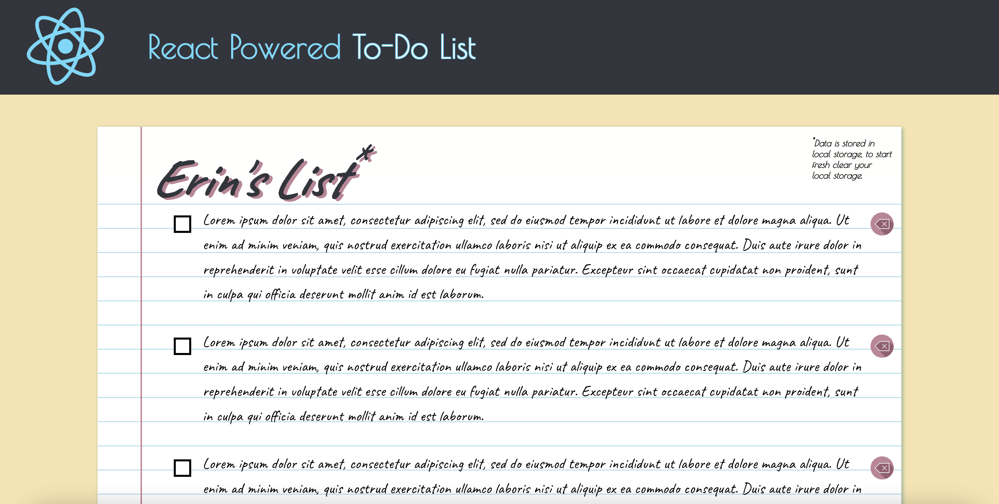

# React Powered To-Do List

## Description

This project was bootstrapped with [Create React App](https://github.com/facebook/create-react-app). This application allows users to create a to-do list. Data is saved in local storage.

## Screenshot

## Deployed page

Page published at: [https://erin-m-keller.github.io/keller-todo/](https://erin-m-keller.github.io/keller-todo/)

## License

Please refer to the LICENSE in the repo.